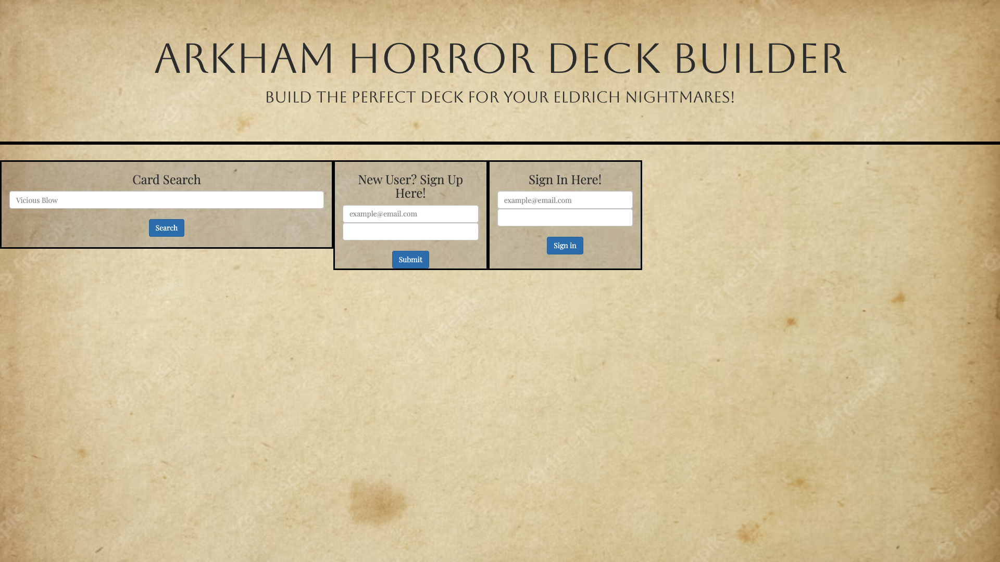
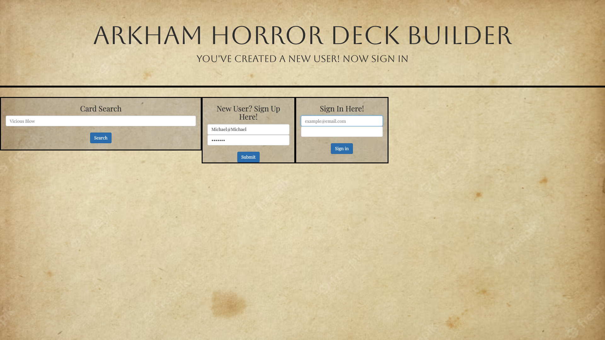
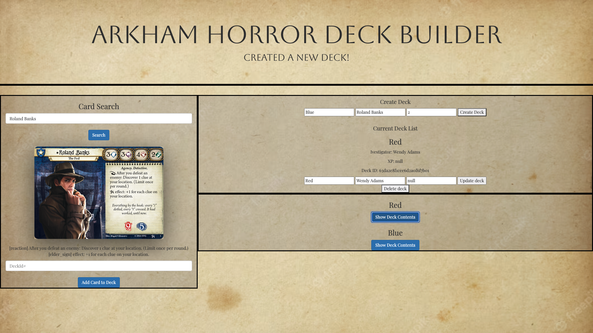

Arkham Horror LCG Deck Builder
================

This application will help create and maintain Arkham Horror LCG decks. Each user will have their own decks and can edit them accordingly. 

## Technology Used

The following tehnology was used to create this version of Minesweeper

- Javascript
- CSS
- HTML
- MongoDB
- Express
- CORS

## Getting Started

Create an account and add your first deck. Use the search bar on the left side to add specific cards using your newly made deck's ID. 

Here is the application. 
https://standarddemacian.github.io/Arkham-Horror-Deck-Builder-Client/

## Next Steps

**Version 2:**

As a User I want...

- Be able to have access to the full card collection 

- Be able to select from a card list to add to my deck

- Be able to CRUD a campaign entity

**Version 3:** 

As a User I want...

- to be able to share my deck with other users

- Users will only be able to add a card that is allowed by the rules

